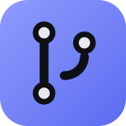
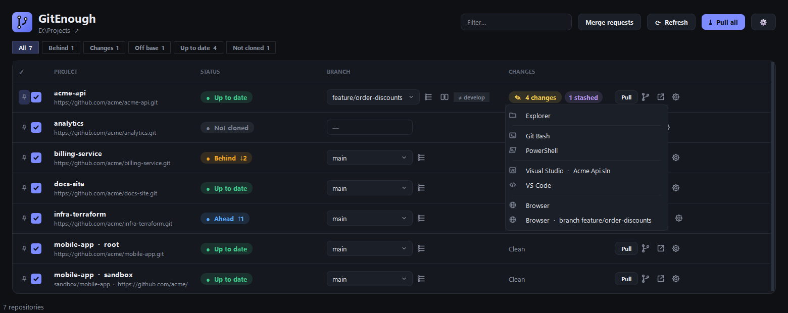
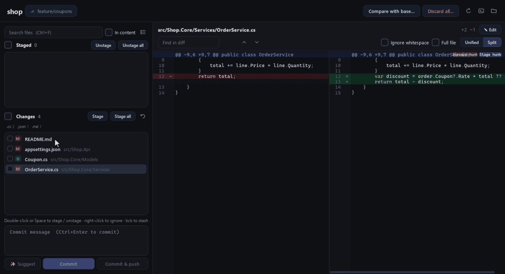
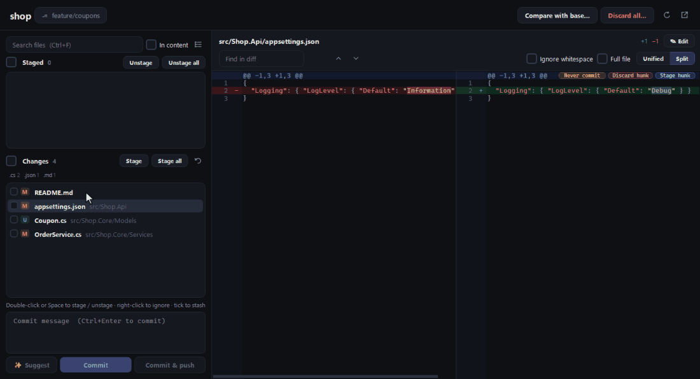
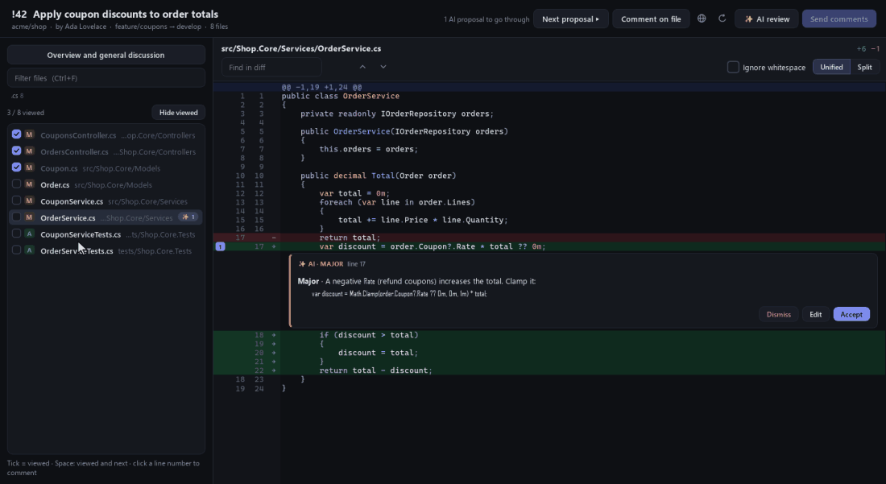
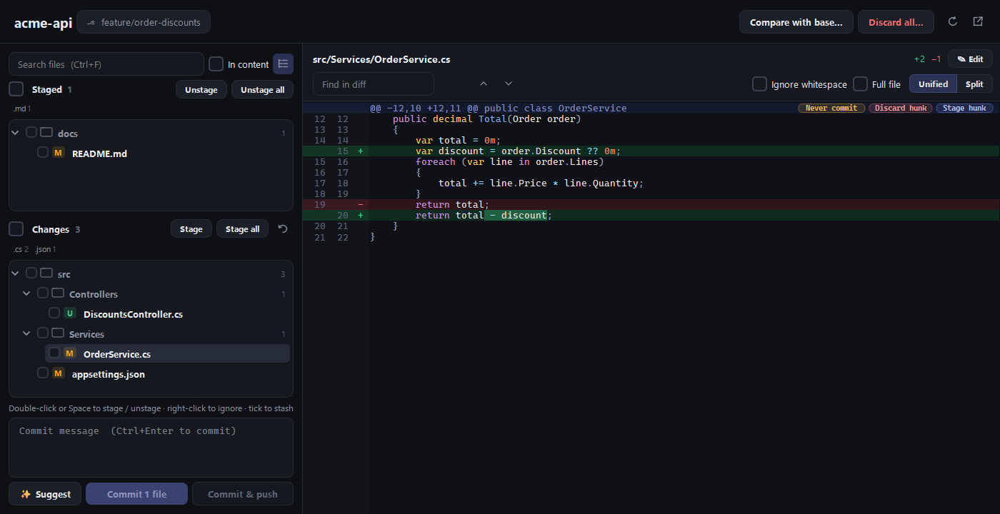
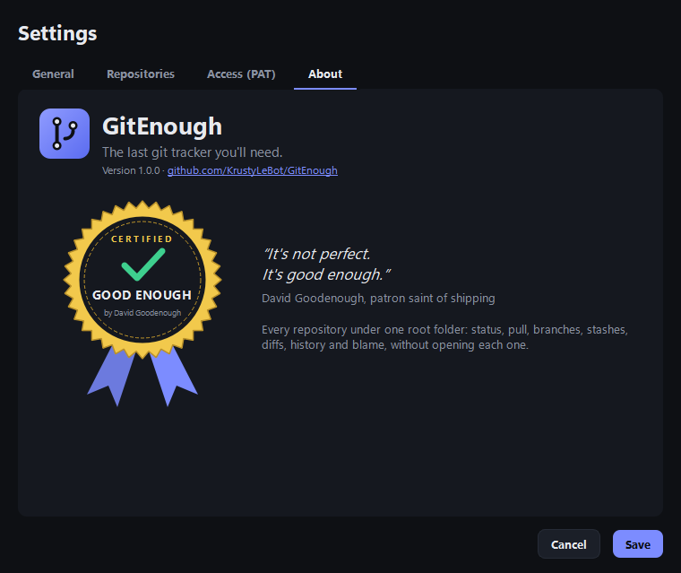

<p align="center">
  
</p>

<h1 align="center">GitEnough</h1>

<p align="center">
  <b>The last git tracker you'll need.</b><br>
  Every repository under one folder, in one window: status, pull, branches, diffs and history.<br>
  GitLab merge request reviews, with Claude when you want a second pair of eyes.
</p>

<p align="center">
  <a href="https://github.com/KrustyLeBot/GitEnough/raw/main/release/GitEnough.exe"><b>⬇ Download GitEnough.exe</b></a>
  &nbsp;·&nbsp; Windows 10 / 11 &nbsp;·&nbsp; single file, no install
</p>

<p align="center">
  
</p>

## Why

You have dozens of repositories in `D:\Projects`. Some are behind, some have local changes, some sit on an old
feature branch, and one still points at the server you left last year. GitEnough finds them all and shows their
state at a glance, so you pull, switch and commit without opening each one.

## Features

**Overview**
- Finds every git repository under a root folder, at any depth, plus the URLs you list (clone them in one click).
- Status per repository: up to date, behind, ahead, diverged, local changes, stashes, off the base branch,
  rebase or merge in progress.
- **Needs rebase** flag: when the base branch moved on (`↓3 develop · Rebase`), one click opens the rebase
  assistant preset for that branch.
- Filters (behind, changes, off base, needs attention…), alphabetical order with pinned projects on top.
- **Pull all** clones what is missing and fast-forwards what is behind, in parallel.
- Refreshes a repository as soon as its files change, and fetches in the background on a timer.
- Every kind of window reopens at the size you last gave it (maximized included).

**Changes and commits**
- Staged / unstaged files as a list or a collapsible folder tree, with a per-extension summary.
- Clean diff viewer: split or unified, syntax highlighting, word-level changes, find in diff. Stays fast on
  generated files with very long lines.
- Stage, unstage or discard whole files, **single hunks or selected lines**.
- **Edit a file in place** (✎ Edit or Ctrl+E): the whole file opens in the diff area, with line numbers and
  syntax colours; Save writes it with its encoding, BOM and line endings unchanged, and the changes are
  evaluated again at once.
- **Stash exactly the files you tick**, from the staged and unstaged lists alike (new files included), then
  choose: revert them, or keep your changes and only save a copy. Nothing else is touched, and applying the
  stash brings staged parts back staged.
- **Suggest a commit message** from the staged diff with Claude (Haiku by default), in the style of your
  recent commits. Drafts, typed or suggested, are kept per repository until you commit.
- Commit, commit and push, ignore files (by name, extension or folder), discard all or stash instead.

<table>
  <tr>
    <td width="50%"></td>
    <td width="50%"></td>
  </tr>
  <tr>
    <td align="center"><sub>Edit a file in place, save, the diff follows</sub></td>
    <td align="center"><sub>Stash only the files you tick</sub></td>
  </tr>
</table>

**Branches and history**
- Commit graph of the current and base branches, commit details and per-file diffs.
- Create, rename, delete and clean up merged branches; tags; stashes (apply, pop, drop).
- Compare a branch with its base, like a merge request preview.
- File history and blame.
- **Rebase onto** assistant (`git rebase --onto`): pick the branch, the new base and the old base commit, see
  exactly which commits move, then force push **with lease** when done. Warns when the branch is behind its
  remote.
- **Built-in merge tool**: for every conflict, keep one side, both (in either order), neither, or write your own
  text. Sides are named after their branch (`origin/develop`, `feature/x`, `stash`), never "ours / theirs".
- **Reset to a remote branch**: after someone force-pushed, recreate your local branch from `origin/…` in one
  click, with your changes stashed and your old commits kept in a backup branch.
- Conflicts explained in plain words, with **Stash & retry** when local changes block a pull or a switch.

**GitLab merge requests**
- The merge requests where you are reviewer, assignee, mentioned or author, on every GitLab server of your
  repositories (gitlab.com or self-hosted), plus any merge request you paste a link to.
- Review window built for large merge requests (400+ files): file list with a **viewed** tick (Space marks a
  file viewed and opens the next one, *Hide viewed* keeps only what is left and the files with open comments),
  one diff at a time, about 30 ms per file.
- Discussions **inline under their line**: reply and resolve right away. Click a line number to write a
  comment; your comments wait as drafts and **Send comments** publishes them as one GitLab review.
- The overview gathers the description, the general discussion and every comment by file, with *Go to file*.
- **Pipeline, approvals and merge state** at a glance under the title. **Approve** (or revoke) in one click.
  Click the pipeline to see it in the app: stages, jobs, and the log of the job you pick, the failed one first;
  it refreshes while it runs, with *Open in GitLab* one click away.

**AI code review (Claude)**
- **AI review** runs Claude (Sonnet by default) on the merge request and turns its findings into proposals
  placed on the right line: **Accept**, **Edit** or **Dismiss** each one, then send.
- Claude reads the full code, not only the diff: GitEnough checks out the merge request's exact commit in its
  own lightweight clone (no file history, no Git LFS), never in your working clones.
- The project's `CLAUDE.md` files are used as review rules; comments are written in English.
- Optional **review skill**: point GitEnough at a GitLab project whose CI builds `.skill` files as artifacts,
  pick one, and it is installed for Claude Code, kept up to date at each refresh, and flagged if it disappears.
- Proposals and drafts survive closing the window. A new AI review replaces the proposals of the last one.

<p align="center">
  
</p>

**Per repository**
- Change the remote URL (moving to another server takes a few seconds), custom name and base branch.
- Open in Visual Studio (`.sln` / `.slnx`), VS Code, Git Bash, the file explorer or the browser.
- Hide a repository, or delete its folder to the Recycle Bin after a check for unpushed work.

<p align="center">
  
</p>

## Getting started

1. Install [Git for Windows](https://git-scm.com/download/win) if it is not there yet.
2. Download [`GitEnough.exe`](https://github.com/KrustyLeBot/GitEnough/raw/main/release/GitEnough.exe) and run it.
3. Open **Settings** (gear icon), pick your root folder, and add repository URLs if you want some cloned.
4. For HTTPS remotes, add a Personal Access Token per host in **Settings > Access (PAT)**. SSH remotes use your
   SSH keys. Several organizations on one server, each with its own account? Add a token per group
   (`gitlab.com/my-group`): each repository uses its group's token, else its host's.
5. For merge requests, the GitLab token needs the **`api`** scope. **Settings > Claude > Access** checks every
   token and tells you what is missing.
6. For the AI features, install [Claude Code](https://claude.com/claude-code) and sign in with your Claude
   subscription (`claude auth login`, or *Sign in* in **Settings > Claude**). No API key is needed; usage counts
   against your subscription. The same page shows the Claude Code version, with an *Update* button, and lets
   you pick the models.

## Updates

GitEnough checks this repository at start and every 6 hours. When a newer version is published, a notification
offers **Update now**: the new executable is downloaded, checked against the published size and SHA-256, swapped
in place of the running one, and restarted. *Settings > About > Check for updates* checks on demand.

## Security and privacy

- Tokens are stored in the **Windows Credential Manager** (encrypted with your Windows session). They are never
  written to the configuration file or into a remote URL, and never passed on a command line.
- The configuration lives in `%APPDATA%\GitEnough\config.json`. Export / import (Settings > General) shares the
  repository list with your team, without any token.
- Background git commands never take the index lock, so they cannot get in the way of your own git commands.
- AI features run through the Claude Code CLI installed on your PC, under your own sign-in. What Claude receives
  (staged diff, merge request diff and code) goes to Anthropic like any Claude Code session. They run only when
  you click them.
- Review clones live in `%LOCALAPPDATA%\GitEnough\review-cache`; **Settings > Claude** shows their size and
  cleans them in one click. Review drafts and viewed files stay in `%APPDATA%\GitEnough`.
- No telemetry: GitEnough only talks to your git servers, this repository for the update check, and Claude
  when you use an AI feature.

## Build from source

Requires Python on Windows (tested with Python 3.13).

```powershell
python -m venv .venv
.\.venv\Scripts\python.exe -m pip install -r requirements.txt pyinstaller
.\build.ps1
```

The executable is written to `dist\GitEnough.exe` and copied to `release\`. To run without building:
`.\.venv\Scripts\python.exe main.py`.

## License

[MIT](LICENSE)

## Good enough

<p align="center">
  
</p>

<p align="center"><i>“It's not perfect. It's good enough.”</i><br>David Goodenough</p>
